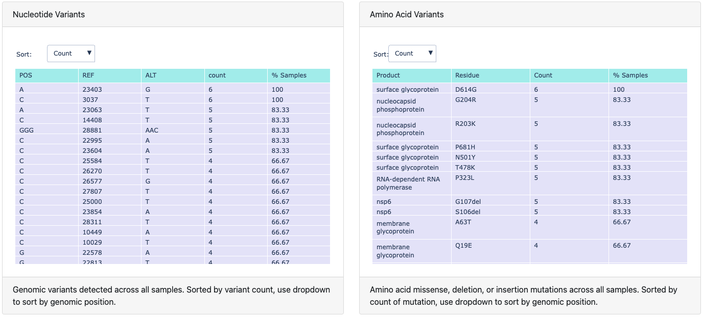
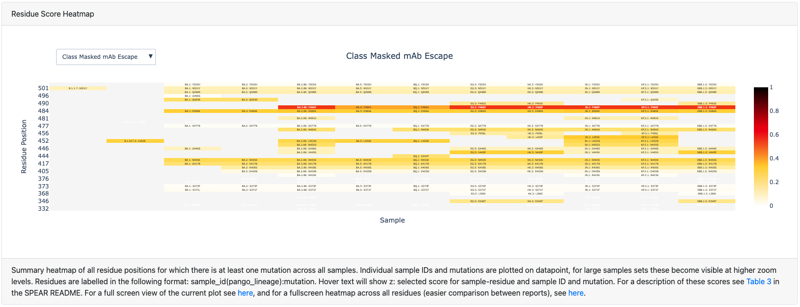
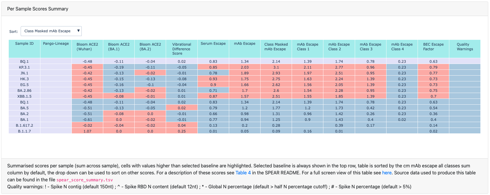
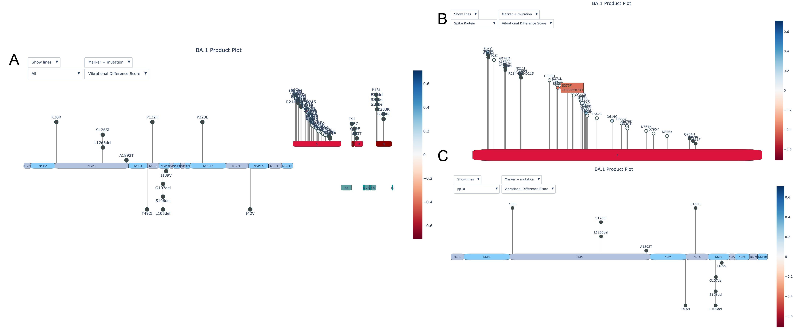

# SPEAR Reports
SPEAR Reports is a repository of reports produced from the Systematic ProtEin AnnotatoR (SPEAR) tool for lineages and sequences of interest. It also contains a log of the current lineages supplied in SPEAR as a baseline file. 

An example SPEAR report for the demo data distributed within SPEAR can be found [here](https://m-crown.github.io/SPEAR-Reports/spear_reports/example_vcfs/report.html). 

This repo is also viewable as a GitHub pages site [here](https://m-crown.github.io/SPEAR-Reports).
  
## SPEAR Report Format

SPEAR Reports are composed of four components: a summary of the nucleotide and amino acid mutations found across all samples in the input set; a heatmap displaying residue scores where mutations exist; a table summarising these scores for each sample; and, optionally, an interactive product plot displaying mutated residues and residue scores for each sample. 

### Mutation summaries

The nucleotide changes summary table lists all mutations (point mutations, insertions and deletions), including those in intergenic regions and synonymous mutations, found across all samples, and lists observation count and the percentage of samples each mutation is seen in. 

The amino acid changes table lists all missense, insertion and deletion events, again with counts and percentage of samples these mutations are observed in. 

These tables may be useful when discussing new lineages and variants, as they can provide a quick overview of the mutations shared amongst samples in both nucleotide and amino acid space.

### Heatmaps

### Sample Score Summaries

### Product Plots

## SPEAR Baseline 

Lineages currently in SPEAR baseline set:  

| Lineage   | Date Added | Issue |
| --------- | ---------- | ----- |
| Alpha | 2022-02-06 | [#1](https://github.com/m-crown/SPEAR-Reports-test/issues/1) |
| Delta | 2022-02-06 | [#1](https://github.com/m-crown/SPEAR-Reports-test/issues/1) |
| Omicron | 2022-02-06 | [#1](https://github.com/m-crown/SPEAR-Reports-test/issues/1) |
| BA.1 | 2022-02-06 | [#1](https://github.com/m-crown/SPEAR-Reports-test/issues/1) |
| BA.1.1 | 2022-02-06 | [#1](https://github.com/m-crown/SPEAR-Reports-test/issues/1) |
| BA.2 | 2022-02-06 | [#1](https://github.com/m-crown/SPEAR-Reports-test/issues/1) | 
