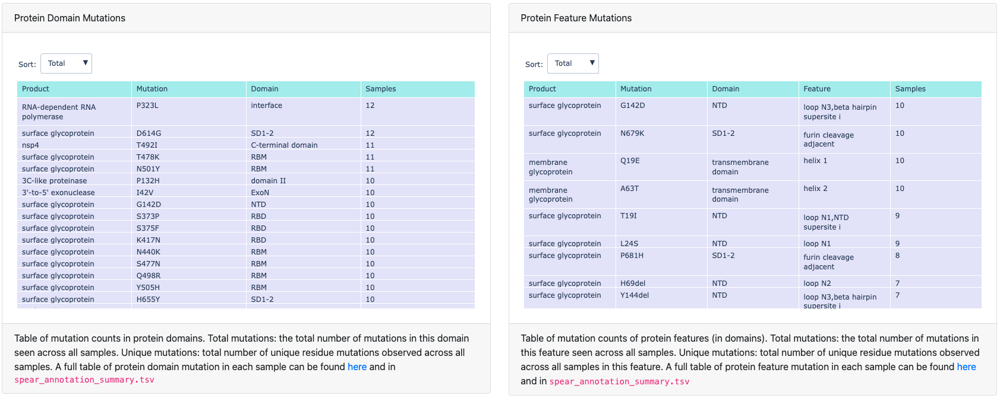

# SPEAR Reports
SPEAR Reports is a repository of reports produced from the Systematic ProtEin AnnotatoR (SPEAR) tool for lineages and genomes of interest. It also contains a log of the current lineages supplied in SPEAR as a baseline file. This repo is also viewable as a GitHub pages site [here](https://m-crown.github.io/SPEAR-Reports).

## Demo Report
An example SPEAR report for the demo data distributed within SPEAR (currently lineages Alpha, Delta, BA.1, BA.1.1, BA.2, BA.2.12.1, BA.4, BA.5) can be found [here](https://m-crown.github.io/SPEAR-Reports/spear_reports/example_vcfs/report.html). 
  
## SPEAR Report Format

SPEAR Reports are composed of four components: a summary of the nucleotide and amino acid mutations found across all samples in the input set; a heatmap displaying residue scores where mutations exist; a table summarising these scores for each sample; and, optionally, an interactive product plot displaying mutated residues and residue scores for each sample. 

### Mutation summaries

The nucleotide changes summary table lists all mutations (point mutations, insertions and deletions), including those in intergenic regions and synonymous mutations, found across all samples, and lists observation count and the percentage of samples each mutation is seen in. 

The amino acid changes table lists all missense, insertion and deletion events, again with counts and percentage of samples these mutations are observed in. 

These tables may be useful when discussing new lineages and variants, as they can provide a quick overview of the mutations shared amongst samples in both nucleotide and amino acid space. 

### Heatmaps

The mutated residue heatmaps contain scores as discussed in the main [SPEAR repo](https://github.com/m-crown/SPEAR#scores). These can be used to identify residues contributing to likely immune escape and altered ACE2 binding. The dropdown menu allows for selection of different scoring metrics. The heatmaps are also fully interactive, allowing for zoom onto specific samples/residues and showing residue scores on hover. 

An additional heatmap is linked within the report showcasing mutations across all residues -  this will allow easier comparison between reports. 

### Sample Score Summaries

Table containing summary score values per sample, with highlighted cells where scores exceed that of the selected baseline. The baseline will always be the top row of the table. For an extended discussion of the SPEAR summary scores see [SPEAR Table 4](https://github.com/m-crown/SPEAR/blob/main/docs/Table4.md). The dropdown allows for re-sorting of samples by the available score metrics, in descending order. 

### Domain and Feature tables

Tables containing summaries of the domains and features within domains which contain AA point mutations, insertions or deletions. 

### Product Plots

Product plots are produced for all samples passing QC. These plots are available from the main report under the collapsed Product Plots link.    

These plots show the sample mutations in their relative product/ORF positions (A). Each mutation is represented by a point, coloured depending on the selected score from the dropdown links in the top left. Subsets of products can be viewed by selecting from the dropdown, allowing for closer inspection in mutation dense regions (e.g. Spike or pp1a - see C). For residues in Spike which have been assigned a score, hovering over a residue will display the score associated with the selected metric (see B). 

## SPEAR Baseline 

There is no definitive list of mutations for a lineage, as different resources, groups and government bodies may use different metrics to determine the canonical set of mutations at AA or genomic level (e.g. [outbreak.info](https://outbreak.info) selects by mutations shared amongst 75% sequences, but [Pango-Designation](https://github.com/cov-lineages/pango-designation/) often use a small initial set of sequences to determine this canonical set). 

The VCFs produced and distributed in SPEAR are a best effort at consolidating these multiple sources whilst also reflecting the natural samples we observe when sequencing SARS-CoV-2 genomes. Where the exact genomic event could not be found for a particular mutation in existing definitions, natural samples observed as part of Northumbria University SARS-CoV-2 sequencing were consulted for that particuar lineage. 

Lineages currently in SPEAR baseline set:  

| Lineage   | Date Added | Issue |
| --------- | ---------- | ----- |
| Alpha | 2022-02-08 | [#1](https://github.com/m-crown/SPEAR-Reports/issues/1) |
| Delta | 2022-02-08 | [#2](https://github.com/m-crown/SPEAR-Reports/issues/2) |
| Omicron | 2022-02-08 | [#3](https://github.com/m-crown/SPEAR-Reports/issues/3) |
| BA.1 | 2022-02-08 | [#4](https://github.com/m-crown/SPEAR-Reports/issues/4) |
| BA.1.1 | 2022-02-08 | [#5](https://github.com/m-crown/SPEAR-Reports/issues/5) |
| BA.2 | 2022-02-08 | [#6](https://github.com/m-crown/SPEAR-Reports/issues/6) | 
